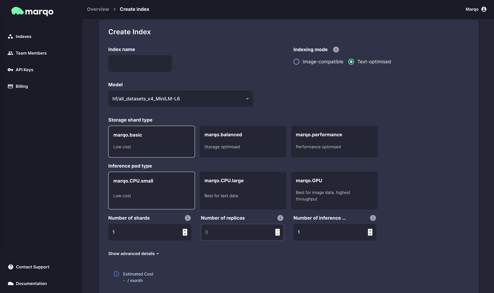

<p align="center">

</p>


<p align="center">
<b><a href="https://marqo.ai">Website</a> | <a href="https://docs.marqo.ai">Documentation</a>   | <a href="https://join.slack.com/t/marqo-community/shared_invite/zt-1d737l76e-u~b3Rvey2IN2nGM4wyr44w">Slack Community</a> | <a href="https://cloud.marqo.ai">Marqo Cloud</a>
</b>
</p>


# Getting Started with Marqo Cloud

Welcome to the Marqo Cloud getting started guide. In this page we will go through how to get set up and running with Marqo Cloud starting from your first time login through to building your first application with Marqo.

# Navigating the Console

In this section we will get acquainted with the console.

If you haven't made an account yet then you can [sign up here](https://cloud.marqo.ai/).

## First Time Login

Head to your cloud console and [sign in](https://cloud.marqo.ai). This will bring you to the console landing page.

# Tour of the Console

## Making an Index

Note: you will not incur any costs on your Marqo account unless you create an index so you can follow along with this section and cancel the creation at the end to avoid any costs.

You can navigate to your indexes but clicking on the indexes tab on the left nav bar.


This will bring you to the indexes page, here you can view and managed your indexes once they have been created.

To create a new index, click the create index button.


You can now configure the index as needed for your application. We will talk through what each of these sections mean in the following sections. The screen will look like this.



### Index name

This is self explanatory. This will be the name of your index. You will use this name to reference you index in your code and it will be displayed in the console. 

<!-- Your index names must be unique within your account. -->

### Indexing mode

The indexing mode is effectively a shorthand for your index configuration. Choosing `Test-based` (the default) will automatically choose a model that is suitable for indexing text-only data. Likewise, choosing `Multi-modal` will choose a model that is suitable for indexing text and images. You can view these index settings in detail under the `Hide advanced details` accordion above the estimated cost.

### Storage shard type

The storage shard type is the type of storage that will hold your vectors. The storage pod indexes your vectors (which are created by the inference pods) and searches them. There are three storage shard types available:

+ `marqo.basic`
    + Marqo basic is the cheapest of the shard types. This is good for proof of concept applications and development work. These shards have higher search latency that the other options and each shard has a lower capacity of approximately 2 million vectors. These shards cannot have any replicas either so they are note recommended for production applications where high availability is a requirement.
+ `marqo.balanced`
    + Marqo balanced is the middle tier of the shard types. This is good for production applications where high availability is a requirement. These shards have lower search latency than `marqo.basic` and each shard has a higher capacity of approximately 16 million vectors. These shards can have replicas so they are suitable for production applications where high availability is a requirement.
+ `marqo.performance`
    + Marqo performance is the highest tier of the shard types. This is good for production applications where high availability and the lowest search latency is a requirement, especially for indexes with tens or hundreds of millions of vectors. These shards have the lowest search latency of all the shard types and each shard has a capacity of approximately 16 million vectors. These shards can have replicas so they are suitable for highly available production application with millions of users.

For the tutorials in this getting started guide we will only use `marqo.basic` shards however if you are deploying a production search with many users we recommend using `marqo.balanced`. For larger enterprises with large number of concurrent searches a `marqo.performance` shard is likely more suitable.

The shard type, number of shards, and number of replicas you pick in index creation will be fixed. To try a different configuration for these values you will need to create a new index.

### Inference pod type

The inference pod type adjusts the infrastructure that is used for inference. Inference is the process of creating vectors from your data. A more powerful inference node will reduce latency for indexing and search by creating vectors faster. Inference pod type has a particularly big difference on latency for indexing or searching with images. There are two inference pod types available:

+ `marqo.CPU.small`
    + Marqo CPU Small is the smallest and cheapest inference pod available. It is targeted towards very small applications or development and testing where speed is not critical. The `marqo.CPU.small` is a very cost effective way to start out with Marqo and experiment with developing applications on the cloud.
+ `marqo.CPU.large`
    + Marqo CPU large is the middle tier of the inference pod types. This is suitable for production applications with low latency search. For many applications a `marqo.CPU.large` pod will be sufficient when searching with text however if searching or indexing image and dealing with very high request concurrency these may become too slow.
+ `marqo.GPU`
    + Marqo GPU is the highest tier of the inference pod types. This is suitable for production applications with low latency search and high request concurrency. These pods are significantly faster than `marqo.CPU` pods when indexing or searching with text and/or images.

A common usage pattern is to mix these nodes for different stages of development. For example you can accelerate indexing of images with `marqo.GPU` pods and then swap to `marqo.CPU.large` pods for searching with only text. You can change your inference configuration at any time by editing the index.

### Number of shards, replicas, and pods

This will configure how many instances of the storage and inference classes will be created. Each shard is an instance of your storage type and will multiply the cost of the storage type by each shard. Each replica will contain all your shards and thus multiplies the cost of all your shards. Replicas increase availability and also reduce latency as the search traffic can be balanced across your replicas. For production applications at least one replicas is recommended.

The number of inference pods will multiply the cost of your inference pod type by the number of pods. This will increase the speed of indexing and searching as the load can be balanced across your pods. You can scale down to zero to remove your inference costs however you index cannot be accessed programmatically while there are no inference pods. A higher number of inference pods will help in applications with high request concurrency. For many applications one or two pods will be sufficient.

### Advanced details

You can also edit your index configuration with the advanced details section. For details on the index default object please [refer to our documentation](https://docs.marqo.ai/latest/API-Reference/indexes/#index-defaults-object). 

The most common change you will likely want to make here is to change the model you are using. For example if you are indexing text data and want higher relevancy in exchange for higher latency you could configure `"model": "hf/e5-large"` which has a larger embedding space of 1024 dimensions and benchmarks better on retrieval benchmarks than the default model however inference search both take longer due to its increased size. 

For a list of all available models please [refer to our documentation](https://docs.marqo.ai/latest/Models-Reference/dense_retrieval/).

### Create index

Once you are done with configuration you can create your index by clicking "Create Index" at the bottom. This will take you to the index page where you can see your index being created. This will take a few minutes to complete. You can refresh the page to see the status of your index. Once it is ready you will be able to use it.

For now you can click cancel and return to this page when you are ready to follow one of the tutorials in this guide or to build your own application.

### Endpoints

Once you have made an index and its creation has completed (usually about 10 minutes) you will be able to copy its endpoint URL from the indexes page on the console.

### Testing your endpoint

If you have created an index you can check that it is up and running via the `/indexes` endpoint. You will need to have created and index and given the inference pods time to finish initializing as described in the previous steps. You can check your indexes via Python or via cURL as follows.

Python:
```python
import marqo
url = "https://api.marqo.ai"
api_key = "<your api key goes here>"
mq = marqo.Client(url, api_key)
indexes = mq.get_indexes()
print(indexes)
```
cURL:
```curl
curl "https://api.marqo.ai/indexes" -H 'X-API-KEY: <your api key>'
```

You should see output along the lines of

```json
{"results": [{"index_name": "my-first-index"}]}
```

### Deleting an Index

__Note: Index deletion is permanent and cannot be undone.__

When you are done with an index you can delete it from the cloud console. Navigate to the indexes page and click the three dots on the right of the index you want to delete. Click delete and confirm the deletion. This will delete the index and all the data in it, index deletion cannot be undone.


## Making an API key

You can managed your API keys in the API Keys tab on the left nav bar. You will have a key called default when you first log in. You can create a new key by clicking the new API key button at the top right. If you want to cycle API keys or need to revoke access for one you can simply delete it from this page and it will cease to work.

## Managing Team Members

You can manage team members by heading to the Team Members tab in the left nav bar. You can invite new team members by clicking the New Member button at the top right. You can also remove team members from this page.

New members will be sent an email inviting them to your account, this will provide them with full access to the console. You can revoke access by removing them from the team members page.

## Billing

You can view your billing information by heading to the billing tab in the left nav bar. You can view your current and forecasted usage for the month as well as a breakdown of your usage. To update billing information or to view invoice details and historical billing data you can click the View Billing Portal button at the bottom right and your billing portal will open in a new tab.


# Marqo Demo Applications

The following demo applications are a good way to get started building with your new Marqo cloud account! The applications are stored in a getting started repo, you can get the code by cloning it.

```
git clone https://github.com/marqo-ai/getting_started_marqo_cloud.git
```

The commands in these tutorials are for Linux and MacOS. If you are using Windows you can use the Windows Subsystem for Linux (WSL) to run the commands. If you are using a different operating system you will need to adapt the commands to your operating system.

| Demo | Description |
| --- | --- |
| 🛍️ [E-Commerce](./e-commerce-demo/README.md) | Build an E-Commerce image search application using Marqo! This demo uses an AI generated E-Commerce dataset with additional metadata to experiment with score modifiers. |
| 🤖 [Chatbot](./chatbot-demo/README.md) | Build a chatbot that can search your data to generate informed responses using GPT4, get started with an index built from Marqo's documentation. |

# Further reading

## Documentation

For more information on Marqo and how to use it with Python and cURL please refer to the [documentation](https://docs.marqo.ai/latest).

## More Examples

| Name | Description |
| --- | --- |
| 🖼️ [Local Image Search](https://github.com/marqo-ai/local-image-search-demo) | A demo that uses the opensource docker container for image search, all written in Python. Can be adapted to the cloud with minimal changes. |
| 🦙 [Marqo + LLaMa](https://github.com/OwenPendrighElliott/LocalMarqoQA) | This demo shows how to run Marqo with LLaMa, similar to the Chatbot demo in this getting started guide. |
| 🔊 [Searching Transcripts](https://github.com/OwenPendrighElliott/SpeechSearch) | This project shows how you can pipe audio from online sources into Marqo for conversational Q&A. |
| 🦛 [Examples](https://github.com/marqo-ai/marqo/tree/mainline/examples) | Our main repo has a selection of examples for applications that use Marqo. |

## Support

Feel free to reach out [on our community forum](https://community.marqo.ai/).

Marqo Cloud users can reach out for dedicated support via the cloud console.